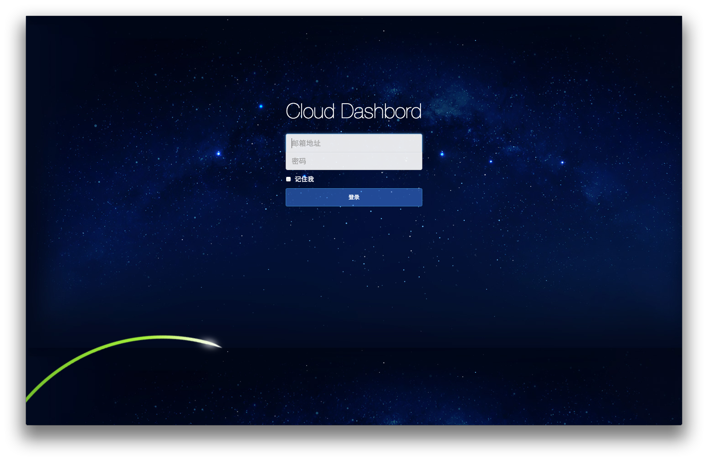
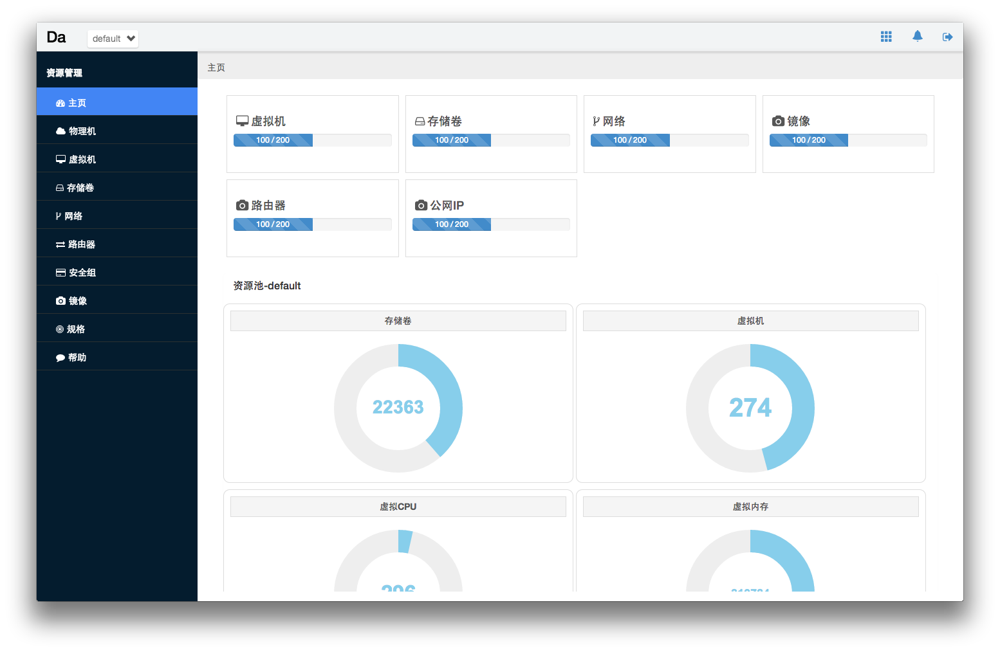
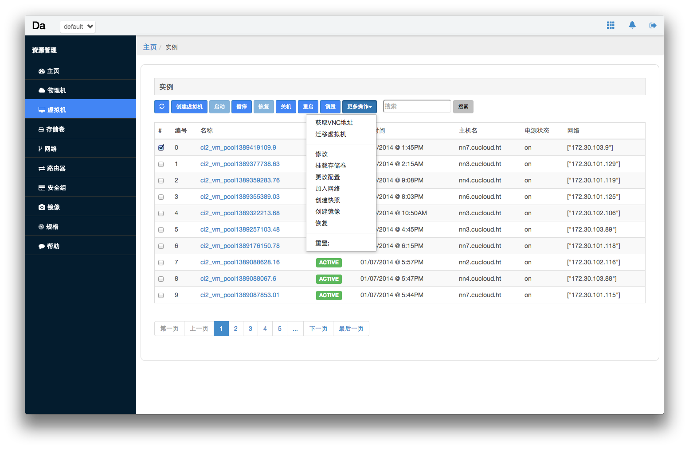
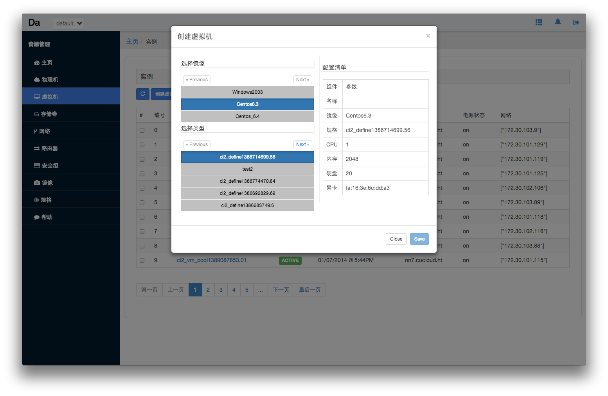
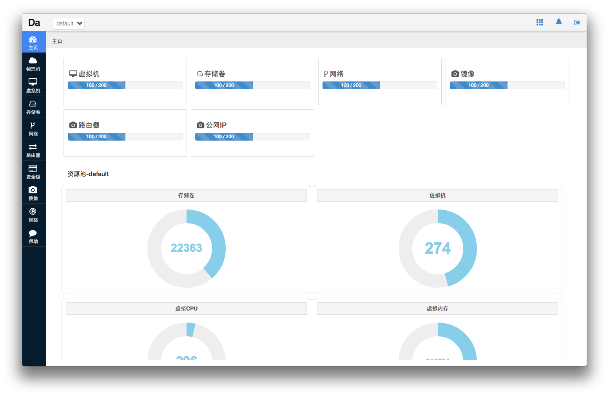

Dashbord Web
============

## What is Dashbord ?

Dashbord is a web front base to build a dashbord application

## Design

### Web

* [Flask](http://flask.pocoo.org/) : Flask is a microframework for Python based on Werkzeug, Jinja 2 and good intentions.

* [Angular.js](http://angularjs.org/) : HTML enhanced for web apps!.

* [Sass](http://sass-lang.com/): the most mature, stable, and powerful professional grade CSS extension language in the world.

* [Jade](http://jade-lang.com/): A Simple Node Template Engine.

* [Bootstrap](http://getbootstrap.com/):  Sleek, intuitive, and powerful mobile first front-end framework for faster and easier web development.

* [angular-ui/bootstrap](http://angular-ui.github.io/bootstrap//‎): Native AngularJS (Angular) directives for Twitter's Bootstrap

### Database

* [Redis](http://redis.io/): an open source, BSD licensed, advanced key-value store.

### Build Tools

* [Yeoman](http://yeoman.io/): MODERN WORKFLOWS FOR MODERN WEBAPPS

* [Grunt](http://gruntjs.com/): The JavaScript Task Runner

* [Bower](http://bower.io/): A package manager for the web


### Code Quality Tools

* [Jshint](http://www.jshint.com/): a JavaScript Code Quality Tool

* [Pylint](http://www.pylint.org/): start your Python code


## How To Develop ?

### Web Front-end Development?

Dashbord is build by [yeoman](http://yeoman.io/index.html) a **MODERN WORKFLOWS FOR MODERN WEBAPPS** And develop by [Angular.js](http://angularjs.org/).

* install the npm requirements.

```
npm install
``` 

* install the bower requirements

```
bower install
```

* the base operation of yeoman

```
yo angular:controller myController
yo angular:directive myDirective
yo angular:filter myFilter
yo angular:service myService
```

* run test

```
grunt test
```

* run application

```
grunt server
```

this operation will start a simple http server on port 9000, [http://127.0.0.1:9000/](http://127.0.0.1:9000/), and this server will auto reload the bowers if the any file has change.

* build

```
grunt build
```

this operation will build the application to the **dict** floder.


### Server Development ?

> This project now is base on Python Flask Web Framework.

The Global target of server is proxy the http request to vms serer. on same time server will cahce the query data from vms.

The Cache update will base on two way. First, when user send a http request by 'POST', 'PUT', 'DELETE' server will send a signal to update the cache.
The sencod way is subscription the rabbitmq message and update the cache.


## ScreenSnapshot










